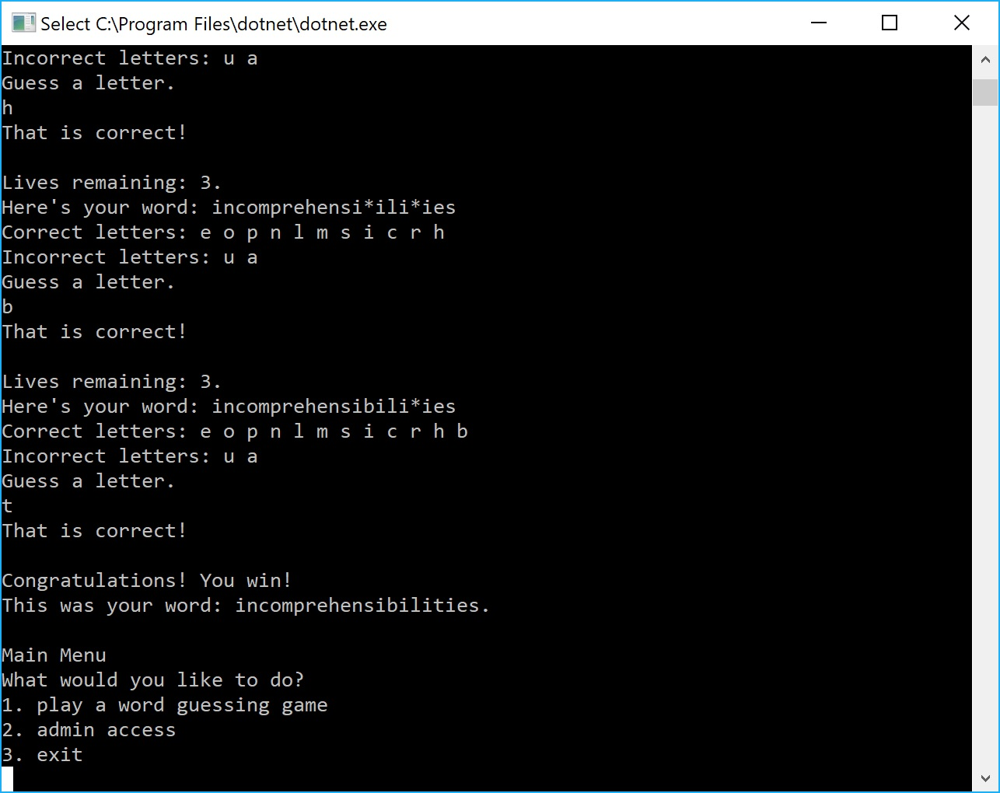

# Lab03-System-IO
CODE: System I.O assignment for Code Fellows 401 C#/ASP.NET course

**Author**: Earl Jay Caoile  
**Version**: 1.0.0

## Overview
This console app provides a word guessing game in which the user types in letters to figure out a random word from a file containing a list of words.
  
An admin view is also available to let the user add and delete words as well as view text files.
## Getting Started
The following is required to run the program.
1. Visual Studio 2017 
2. The .NET desktop development workload enabled
3. No External NuGet packages are required for this application. 

## Example

## Architecture
This application is created using ASP.NET Core 2.1 Console applicaitons.  
*Language*: C#  
*Type of Applicaiton*: Console Application  

## Change Log
06-07-2018 7:00pm - Initial file scaffolding  
06-08-2018 10:00am - basic menu written  
06-08-2018 11:00pm - word match functionality implemented  
06-08-2018 1:00pm - game functionality complete  
06-08-2018 2:00pm - admin menu written  
06-08-2018 7:00pm - admin functionality complete (create, delete, and view text files)  
06-08-2018 9:00pm - refactoring and code optimization  
06-08-2018 10:00pm - start on tests  
06-09-2018 1:00pm - succesful tests  
06-09-2018 1:30pm - added comments to methods  
06-09-2018 2:30pm - finished readme  

